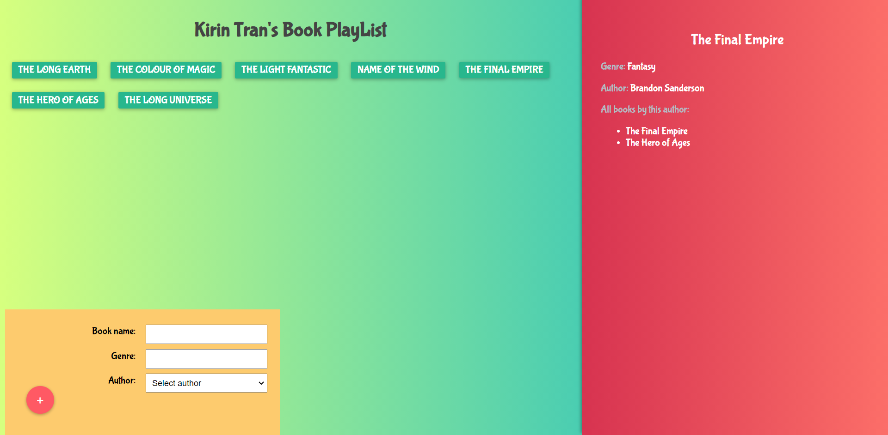

#  Book Playlist

## [Try it here](https://kien123456k.github.io/book-playlist-frontend/)
**Note:** May take a few minutes to start the backend server due to Heroku need time to wake up

## What is Book Playlist?
- A cool Book Playlist to store your favorite books build with GraphQL API. 

## Technology
- Frontend
  - React - A JavaScript library for building user interfaces
  - Create React App - React Starter Template
  - GraphQL + React Apollo - API Query Language Client
- Backend
  - Express - Server Core
  - GraphQL + Express GraphQL - API Query Language Server
  - Mongoose + MongoDB - Database

## Some preview images


## Available Scripts
- To advoid the complexity of setup client and server, I strongly recommend you to setup with `Docker`
- If you want to run Book Playlist without `Docker` or run separately, read the `README.md` in `client` and `server` folder.
- In the project directory, you can run following commands to setup with `Docker`:

## Start up docker containers
```
yarn start
```

## Shutdown docker containers
```
yarn stop
```

# License & copyright

© Kirin Tran, FPT University TP.HCM
Licensed under the [MIT LICENSE](LICENSE).